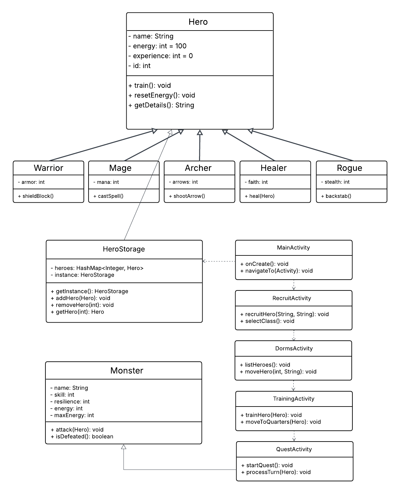

# Hero Academy Manager

**Course:** Object-Oriented Programming, LUT University  
**Group Name:** Java G  
**Team Members:** 
Prashanna Shrestha - 003140938 - Prashanna.Shrestha@student.lut.fi
Niranjan Pun - 003148998 - Niranjan.Pun@student.lut.fi
Dipanjan Bhowmik Anol - 003296947 - Dipanjan.Bhowmik@student.lut.fi

---

## What is this project

Hero Academy Manager is an Android app where you play as the Headmaster of a fantasy hero academy. The project is based on the Space Colony assignment from the course but we changed the theme to fantasy because we thought it would be more fun to work with. Instead of space crew members you have heroes, instead of a space station you have a dorm, training grounds and a quest board. The mechanics are same as the original assignment described in a main project plan.

The player can recruit heroes, move them around different locations, train them to get stronger and send them on quests to fight monsters to level up further. If a hero dies in combat they are gone permanently. That is the whole game loop.

---

## How to install and run

1. Clone or download this repo from GitHub
2. Open the project in Android Studio
3. You need Android SDK API 24 or higher to run it smoothly
4. Press the Run button or Shift+F9
5. App will launch on emulator or a connected phone

No extra setup needed. The app saves all data automatically on the device so heroes are still there when you reopen the app.

---

## Features we implemented

### Basic features

- Hero Recruitment: player types a name and picks one of five classes according to their taste which are Warrior, Mage, Archer, Healer and Rogue. Each class has its own stats and a special ability.
- Three locations: Dorms where heroes rest and recover energy, Training Grounds where heroes train and gain XP, and Quest Board where heroes wait to go on a quest for huntuing and fun.
- Training system: each training session costs 10 energy and gives 1 XP. XP permanently increases the hero skill power in combat.
- Turn based combat: two heroes fight a monster together. They take turns acting and the monster retaliates after each action. If a hero energy drops to zero they die and get removed from the app.
- Monster scaling: every new quest generates a stronger monster based on how many quests you already completed.
- Energy recovery: when a hero is sent back to Dorms their energy fully restores but they keep all their XP.

### Bonus features

| Feature | Points |
|---|---|
| RecyclerView for listing heroes | +1 |
| Hero class images | +1 |
| Data persistence, save and load | +2 |
| Tactical combat with player chosen actions | +2 |

For tactical combat the player can choose between Attack, Defend and Special each turn. Defend doubles the hero resilience for that turn. Special ability is different for each class.

---

## OOP concepts used

**Inheritance:** There is a base Hero class with shared attributes like name, energy, experience and id. Five subclasses extend it which are Warrior, Mage, Archer, Healer and Rogue. Each subclass adds its own unique stat and overrides the special ability method.

**Encapsulation:** All hero attributes are private. They can only be accessed through getters and setters.

**Singleton pattern:** HeroStorage uses singleton pattern so there is only one instance managing all hero data across the whole app.

**Polymorphism:** Each hero subclass override the useSpecialAbility() method differently. For example Mage casts a spell for double damage, Healer heals the partner instead of attacking, Rogue does a backstab with high damage.

**HashMap:** HeroStorage stores all heroes in a HashMap with their ID as the key. This makes lookups fast and works well with RecyclerView.

---

## UML Class Diagram
-Created using Lucidchart.

## App screens

**Main Screen:** Shows how many heroes are in each location and has buttons to navigate to all screens.

**Recruit Screen:** Text field for hero name, radio buttons to pick a class with stats shown, and Create and Cancel buttons.

**Dorms Screen:** RecyclerView list of resting heroes with their stats. You can select heroes and move them to Training or Quest Board.

**Training Screen:** RecyclerView list of training heroes. Train button gives XP. Send to Dorms button restores energy and moves hero back.

**Quest Screen:** Two spinners to pick heroes, Launch Quest button, a scrollable battle log, and three combat action buttons which are Attack, Defend and Special.

---

## How work was shared

This project was mainly done by Prashanna Shrestha. Niranjan Pun and Dipanjan Bhowmik Anol contributed to testing and reviewing the features.

---

## Tools used

- Android Studio
- Java
- Gson library for data saving and loading
- GitHub for version control

---

## AI usage

AI tools were used to help with understanding certain Java, Android concepts during development and to format our document with better english structure. The actual implementation, logic decisions and structure were done by the team.

---

## Links

- GitHub: https://github.com/Prashanna-Xtha/HeroAcademyManager
- Video: https://drive.google.com/file/d/1di-Emh-SvkqHMsF5FBplBfTgTok2WZUE/view?usp=sharing

